# Pharmacy Application Management System

Welcome to the Pharmacy Management System project! This application is designed to efficiently manage a pharmacy, including handling products, employees, departments, salaries, and user orders. Built with C# (.NET) and integrated with a Microsoft SQL Server database, it ensures seamless data storage and retrieval.

---

## Table of Contents

1. [Authors](#authors)
2. [Prerequisites](#prerequisites)
3. [Get Started](#get-started)
   - [Clone the Repository](#clone-the-repository)
   - [Database Configuration](#database-configuration)
   - [Library Dependencies](#library-dependencies)
4. [Architecture/Technology Sections](#architecturetechnology-sections)
   - [Software Architecture Diagram](#software-architecture-diagram)
   - [Database Schema Diagram](#database-schema-diagram)
   - [Application's Screenshots](#applications-screenshots)
5. [Features](#features)
   - [User Features](#user-features)
   - [Admin Features](#admin-features)
6. [Technology Used](#technology-used)
7. [Color Reference](#color-reference)
8. [Roadmap](#roadmap)
9. [Lessons Learned](#lessons-learned)
10. [FAQ](#faq)
11. [Feedback](#feedback)
12. [License](#license)
13. [Acknowledgements](#acknowledgements)
14. [Contact](#contact)

---
## Authors

- [S. S. Zobaer Ahmed](https://www.github.com/sszobaer)

## Collaboration
- [Khyrul Alam](https://www.github.com/khyrulsiam)

## Prerequisites

Before starting, ensure you have the following installed:
- **Visual Studio:** [Download the latest version](https://visualstudio.microsoft.com/)
- **.NET Framework:** Available via Visual Studio or [Microsoft's official site](https://dotnet.microsoft.com/en-us/download/visual-studio-sdks)
- **SQL Server Management Studio (SSMS):** [Download the latest version](https://learn.microsoft.com/en-us/sql/ssms/download-sql-server-management-studio-ssms?view=sql-server-ver16)

## Get Started

### Clone the Repository

Obtain your own copy of the project with:
    
```bash
git clone https://github.com/sszobaer/PharmacyAppliactionManagementSystem.git
cd PharmacyApplicationManagementSystem
```

### Database Configuration

**Database Setup Instructions:**

1. **Create a New Server in SSMS:**
   - Open **SQL Server Management Studio (SSMS)**.
   - Connect to your server using the appropriate credentials.
   - To create a new database, right-click on "Databases" in the Object Explorer pane, select "New Database...", enter `PharmacyManagementSystem`, and click "OK."

2. **Access Database Files:**
   - Navigate to the "database" section in this repository.
   - Download the SQL script files for each table.

3. **Execute SQL Scripts:**
   - Open a new query window in SSMS.
   - Copy and paste or directly open the SQL scripts from the downloaded files into the query window.

4. **Script Execution Order:**
   - Run the SQL scripts in this order:
     1. `SignUpTable`
     2. `AdminTable`
     3. `DepartmentTable`
     4. `EmployeeTable`
     5. `SalaryTable`
   - **Note:** When setting up the database for the first time, use `CREATE DATABASE PharmacyManagementSystem;` if the database doesn't exist, rather than `USE PharmacyManagementSystem;`.

5. **Configure Connection String:**
   - In the **app.config** or **web.config** file of your WinForms application, update the connection string with your SQL Server details:

   ```xml
   <connectionStrings>
     <add name="PharmacyDB"
          connectionString="Data Source=YOUR_SERVER_NAME;Initial Catalog=PharmacyManagementSystem;Integrated Security=True"
          providerName="System.Data.SqlClient" />
   </connectionStrings>
   ```

   - Replace `YOUR_SERVER_NAME` with the name of your SQL Server instance (for example, `localhost` or `.\SQLEXPRESS`).

6. **Integrated Security:**
   - If you're using **Windows Authentication** to access your database, the `Integrated Security=True` setting should work fine.
   - If you're using **SQL Server Authentication**, replace `Integrated Security=True` with the `User ID` and `Password` for your SQL Server credentials:

   ```xml
   <connectionStrings>
     <add name="PharmacyDB"
          connectionString="Data Source=YOUR_SERVER_NAME;Initial Catalog=PharmacyManagementSystem;User ID=yourUsername;Password=yourPassword"
          providerName="System.Data.SqlClient" />
   </connectionStrings>
   ```

Make sure the connection string is set up properly to ensure smooth communication between your application and the database.

### Library Dependencies

- Ensure you have the [SQL Server](https://www.microsoft.com/en-us/sql-server/sql-server-downloads) developer tools installed.

### Architecture/Technology Sections
### Software Architechture Diagram
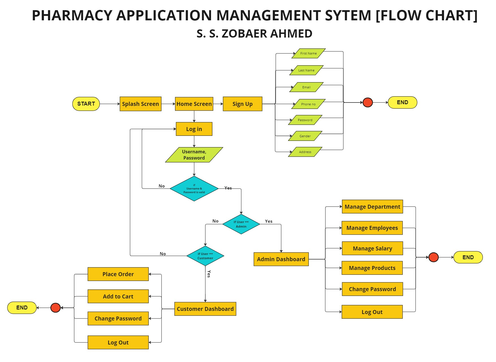

### Database Schema Diagram
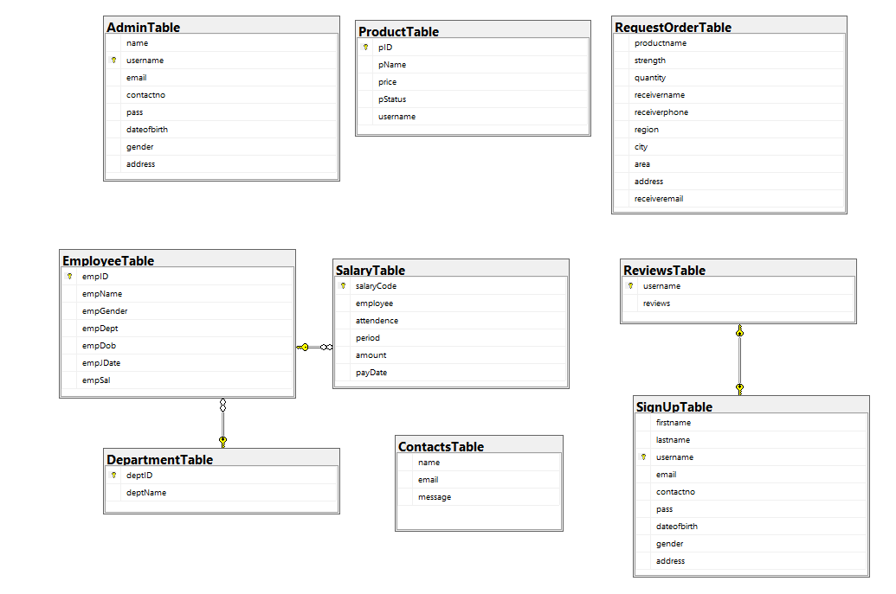

## Application's Screenshots
### Home Page
here's the home page and the login UI
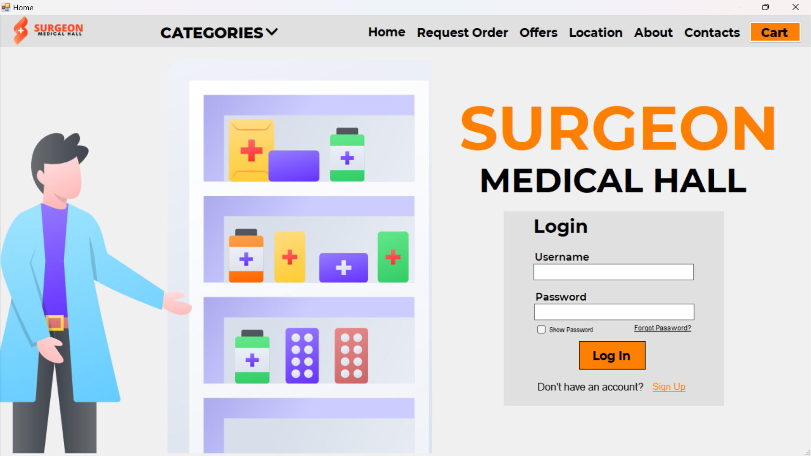

### Sign Up Page
here's the sign up page UI
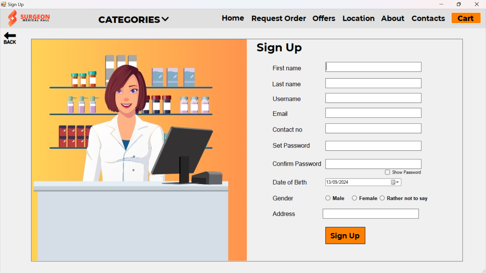

### Request Order
here's the Request Order UI
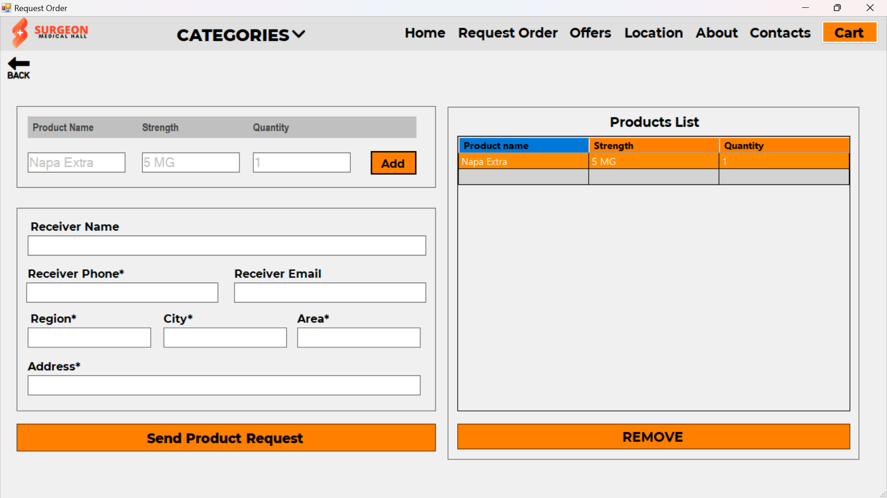

### Product Section
here's the Products UI
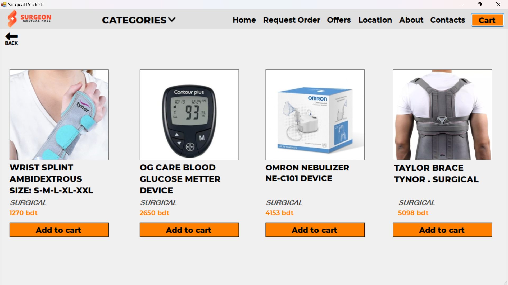

### Location
here's the Location UI
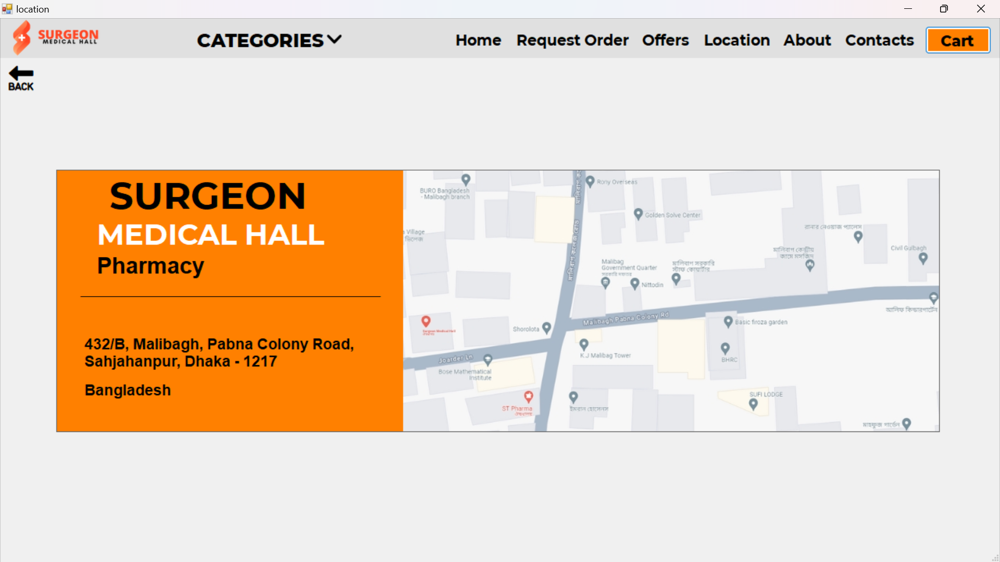

### About
here's the About UI


### Contacts
here's the contacts UI


### User Dashboard
here's the User Dashboard UI
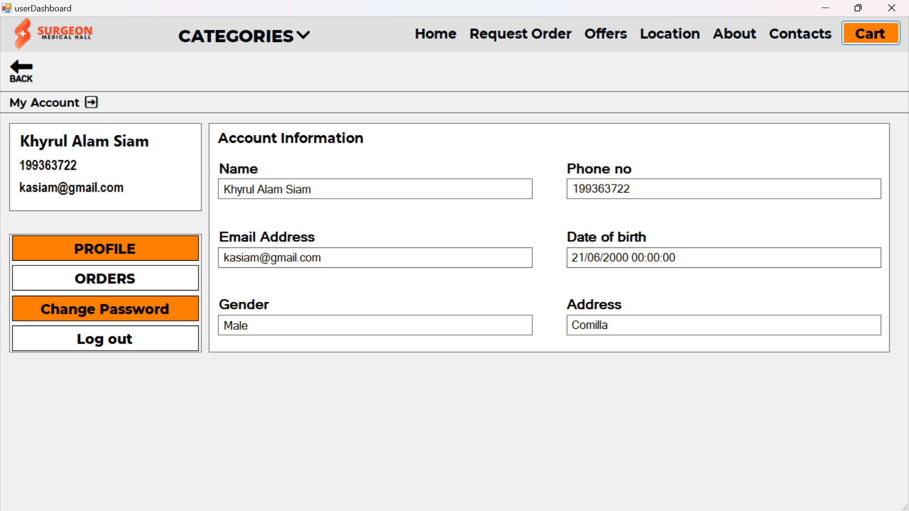

### Cart
here's the Cart UI
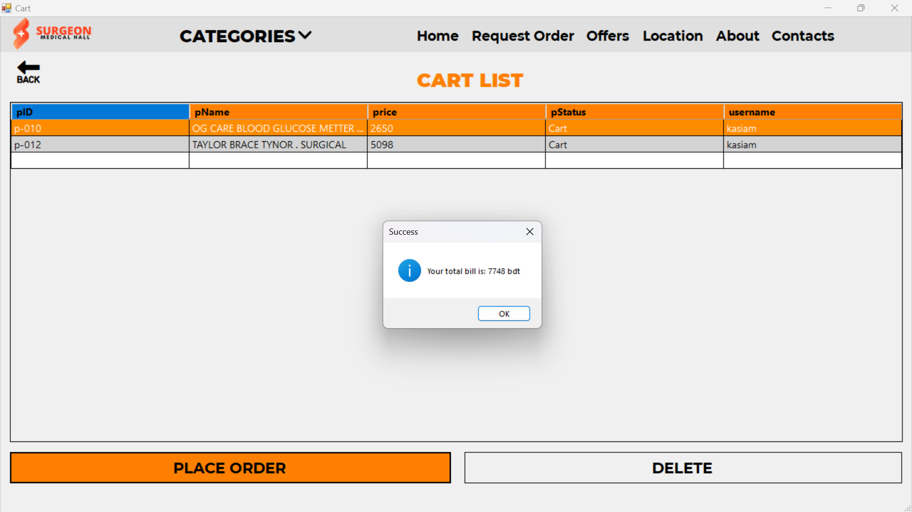

### Payment Section
here's the Payment UI
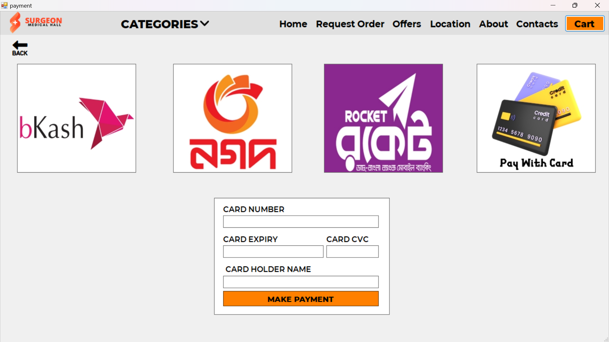

### Admin Dashboard
here's the Admin Dashboard UI
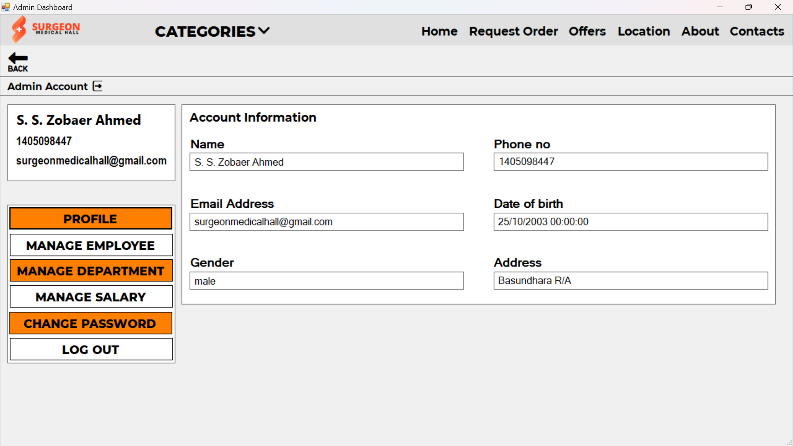

### Manage Department
here's the Manage Department UI
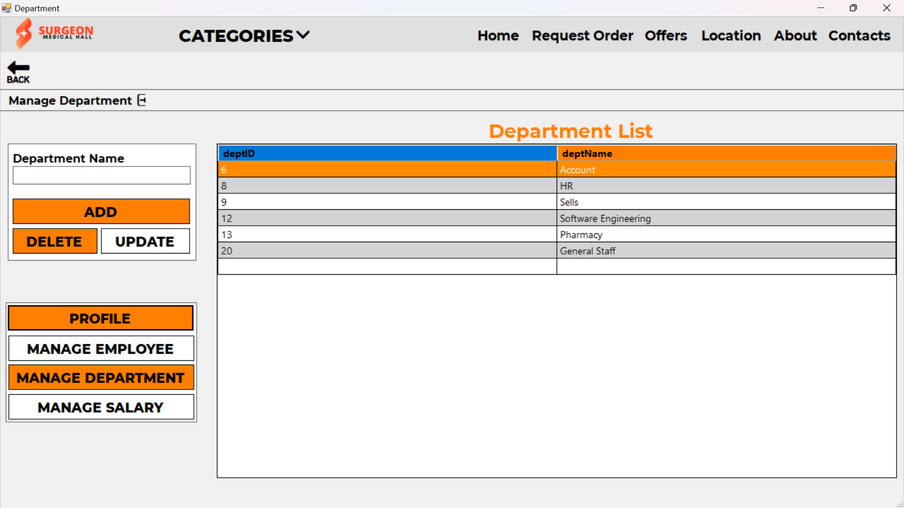

### Manage Employees
here's the Manage Employees UI
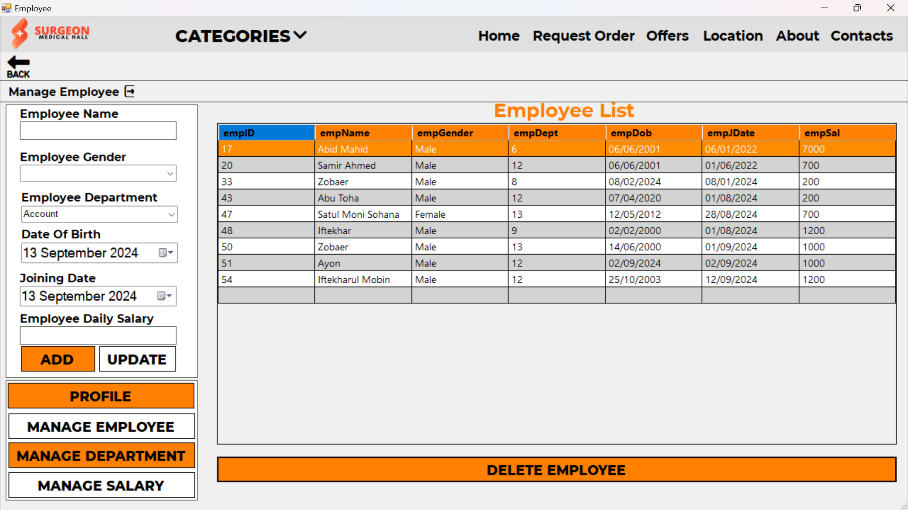


### Manage Salary
here's the Manage Salary UI
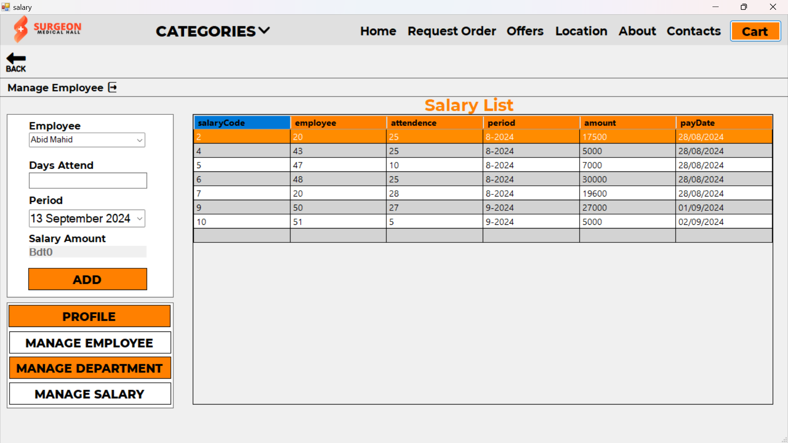

### Request Order
here's the Request Order UI


## Features

### User Features

- **Sign Up & Login / Logout:**
   - Users can create a new account, log in, logout and access their personalized dashboard.
   - Password management includes change and recovery options like "Forgot Password."

- **Product Management:**
   - Users can browse available products and add items to their cart.
   - After selecting products, users can review and place an order from the cart.

- **Order and Payment:**
   - Multiple payment methods are available, including **bKash**, **Nagad**, **Rocket**, and **Banking**.
   - On order confirmation, users can see the total bill and complete their payment.

- **Order History:**
   - Users can view their order history and track past purchases easily.

- **Additional Features:**
   - Users can make request orders, see current offers, and check important information like store locations, contacts, and about info.

### Admin Features

- **Department & Employee Management:**
   - Admins can add new departments and manage employees within each department, including adding employee details like name, ID, daily salary, date of birth, and joining date.

- **Salary Management:**
   - Admins can calculate and pay employee salaries based on their daily wage and the number of days attended.

## Technology Used

- **[C#](https://learn.microsoft.com/en-us/dotnet/csharp/):** A versatile programming language for the .NET platform, used for developing a wide range of applications.
- **[.NET Framework](https://dotnet.microsoft.com/en-us/learn/dotnet/what-is-dotnet-framework):** A comprehensive developer platform for building various types of applications across different operating systems.

## Color Reference

| Color   | Hex                                                                |
|---------|--------------------------------------------------------------------|
| Black   |  #0a192f   |
| White   |  #f8f8f8   |
| Orange  |  #ff4522   |

## Roadmap
The future plans and milestones for my project. Based on my current development stage and features, here’s a sample roadmap:

### Q4 2024

1. **Feature Enhancements:**
   - Expand the **Order System** to include additional payment methods and integrate more detailed analytics for sales and transactions.
   - Improve the **User Dashboard** with advanced features for managing orders and tracking history.

2. **Admin Features:**
   - Implement advanced **Employee Management** tools, including performance tracking and automated attendance reports.
   - Add functionality for **Department and Employee Reports** to generate summaries and insights for better management.

3. **User Experience Improvements:**
   - Refine the **User Interface** based on user feedback to enhance usability and accessibility.
   - Optimize the **Drop-Down Menu** and navigation for better performance and user interaction.

### Q1 2025

4. **Mobile Compatibility:**
   - Develop a **Responsive Design** to ensure compatibility with mobile devices and tablets.
   - Explore the potential for a **Mobile App** version for enhanced accessibility on the go.

5. **Security Enhancements:**
   - Strengthen **Data Security** with advanced encryption methods and secure authentication practices.
   - Conduct a **Security Audit** to identify and address potential vulnerabilities.

6. **Performance Optimization:**
   - Improve the **Performance** of data operations and load times across the application.
   - Implement **Caching** and **Database Optimization** strategies for better efficiency.

### Q2 2025

7. **Integration and Extensions:**
   - Integrate with additional **Third-Party Services** for extended functionality, such as CRM systems or additional payment gateways.
   - Develop **Custom Extensions** or plugins based on user needs and feedback.

8. **User Feedback and Iteration:**
   - Collect user feedback through surveys and user testing to identify areas for improvement.
   - Implement iterative changes and updates based on the collected feedback to enhance user satisfaction.

9. **Documentation and Training:**
   - Update **Documentation** to reflect new features and changes.
   - Develop **Training Materials** and tutorials to assist users and administrators in utilizing new functionalities.

## Lessons Learned

1. **Authentication and Role Management:**
   - Implementing different user roles (User and Admin) provided valuable insight into securing access to specific features, ensuring that users only have access to relevant parts of the system.

2. **Order and Cart System Development:**
   - Building a cart and order system taught the importance of session management, ensuring that user actions like adding to the cart persist seamlessly.
   - Handling multiple payment methods like **bKash**, **Nagad**, **Rocket**, and **Banking** offered practical experience in integrating diverse payment gateways.

3. **Order**

 History and Reporting:**
   - Developing the order history feature highlighted the need for efficient data retrieval and presentation. Ensuring that users can easily access their past orders and details is crucial for a positive user experience.

4. **Database Design:**
   - Designing and managing the database schema for product, employee, and salary tables emphasized the importance of normalization and efficient data organization for scalability and performance.

5. **User Interface and Experience:**
   - Implementing user interfaces and navigation components, such as drop-down menus and splash screens, underscored the need for a clean and intuitive design to improve user interaction and satisfaction.

6. **Error Handling and Security:**
   - Encountering and resolving exceptions, such as connection issues and authentication problems, reinforced the significance of robust error handling and security measures in application development.

## FAQ

**Q: How can I add more products to the system?**
A: To add products, use the product management interface available in the Admin panel. Admins can input product details, including name, price, and description, directly into the system.

**Q: What should I do if I forget my password?**
A: Use the "Forgot Password" feature on the login page to reset your password. Follow the instructions sent to your registered email address.

**Q: How do I change my email or contact information?**
A: Log in to your account and navigate to the profile settings. You can update your email and contact information from there.

## Feedback

If you have any feedback or suggestions for this project, please feel free to reach out or submit an issue on the [GitHub repository](https://github.com/sszobaer/PharmacyApplicationManagementSystem/issues).

## License

This project is licensed under the MIT License - see the [LICENSE](LICENSE) file for details.

## Acknowledgements

Special thanks to:
- **Microsoft** for their development tools and platform.
- **Stack Overflow** and **GitHub** communities for their valuable support and resources.
- And Also <br>
🎓 **Dr. Md. Iftekharul Mobin**  <br>
🎓 Assistant Professor, Department of Computer Science, AIUB <br>
Your guidance has been instrumental in the development of this project.


## Contact

For more information, reach out to:

- **Email:** [ahmedsszobaer@gmail.com](mailto:ahmedsszobaer@gmail.com)
- **GitHub:** [S. S. Zobaer Ahmed](https://www.github.com/sszobaer)
- **Linkedin:** [S. S. Zobaer Ahmed](https://www.linkedin.com/in/s-s-zobaer-ahmed-209bab296?utm_source=share&utm_campaign=share_via&utm_content=profile&utm_medium=android_app)
- **YouTube Channel:** [Code Craft Zobaer](https://www.youtube.com/@CodeCraftZobaer)
